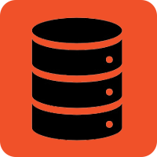
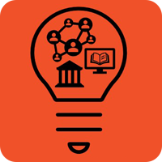
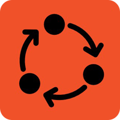
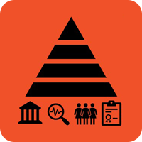

# LC Labs AI Planning Framework

## About 
LC Labs has been exploring how to use emerging technologies to expand the use of digital materials since our launch in 2016. We quickly saw machine learning (ML), one branch of artificial intelligence (AI), as a potential way to [provide more metadata](https://labs.loc.gov/work/experiments/experimental-access/) and [connections](https://citizen-dj.labs.loc.gov/) between collection items and users.  [Experiments and research](https://blogs.loc.gov/thesignal/2023/11/why-experiment-machine-learning-at-the-library-of-congress/) have shown the risks and benefits of using AI in libraries, archives and museums (LAMs).

To account for these challenges and realities, LC Labs has been developing a planning framework to support the responsible exploration and potential adoption of AI at the Library.  Read the full overview of the Labs framework in our [related post on the Signal Blog](https://blogs.loc.gov/thesignal/2023/11/introducing-the-lc-labs-artificial-intelligence-planning-framework).

At a high level, the framework includes three planning phases:  1) Understand 2) Experiment and 3) Implement, which supports the evaluation of three elements of ML: 1) Data; 2) Models; and 3) People. We rely on a set of worksheets, questionnaires, and workshops to engage stakeholders and staff and identify priorities for future exploration. The mechanisms, tools, collaborations, and artifacts together form the AI Planning Framework. Our hope in sharing the framework and associated tools in this initial version is to encourage others to try it out and to solicit additional feedback.  

In planning for and conducting AI and ML experiments at the Library of Congress, we've simplified ML processes into three main elements:  Data, Models, and People. The details of all three elements and how they are put together helps us understand whether an application of this technology is useful, ethical and effective.  

<table>
    <tr>
        <th colspan="3">Elements of Machine Learning / AI</th>
    </tr>
    <tr>
        <td valign="top" style="width: 33.333%">
            <h3>Data</h3>
            

            <ul>
                <li>Library content</li>
                <li>Data readiness</li>
                <li>Training data</li>
                <li>Tuning data</li>
                <li>Validation data</li>
                <li>Target data</li>
                <li>Output data</li>
            </ul>
        </td>
        <td valign="top" style="width: 33.333%">
            <h3>Models</h3>
            

            <ul>
                <li>End-to-end workflow or pipeline</li>
                <li>Architectures</li>
                <li>Type of training</li>
                <li>Libraries utilized</li>
                <li>Frameworks or platforms</li>
            </ul>
        </td>
        <td valign="top" style="width: 33.333%">
            <h3>People</h3>
            

            <ul>
                <li>Develop use cases</li>
                <li>Represented in the data</li>
                <li>Design and sell AI systems</li>
                <li>Impacted by AI systems</li>
                <li>Evaluate and implement</li>
            </ul>
        </td>
    </tr>
</table>

_[Download this table as an image](/img/AIframework-1.jpg)_

Considering the data, models and people involved in an AI system is baked into our AI Planning Framework. The Understand, Experiment and Implement steps include collaborative activities and result in documentation that inform the development of practices and policies for responsible AI. We have yet to move all the way through to the implement stage, but this planning process will build the foundation for a solid and responsible AI strategy based on evidence and Library strengths. 

<table>
    <tr>
        <th colspan="3">LC Labs AI Planning Phases</th>
    </tr>
    <tr>
        <td valign="top" style="width: 33.333%">
            <h3>Understand</h3>
            

        </td>
        <td valign="top" style="width: 33.333%">
            <h3>Experiment</h3>
            

        </td>
        <td valign="top" style="width: 33.333%">
            <h3>Implement</h3>
            

        </td>
    </tr>
    <tr>
        <td colspan="3" style="text-align: center"><strong>→ Governance and Policy →</strong></td>
    </tr>
</table>

_[Download this table as an image](img/AIframework-2.jpg)_

## Understand 
Collaboratively articulate principles; assess risks and benefits, map needs, priorities and expertise; learn about data readiness. 

Tools for use in this phase: 

| Title      | Description | Last Revised | Download | 
| ----------- | ----------- |  ----------- |  ----------- |  
| Use Case Risk Worksheet     | This questionnaire is meant to assist staff in assessing the risk profile of an AI use case. The risk level will inform planning for the level of the risk mitigation efforts, estimated timeline for safety, quality and performance verification, and resources required.       | 2023-11-15 | Link to [worksheet](https://github.com/LibraryOfCongress/labs-ai-framework/raw/main/Understand/Use_Case_Assessment_Worksheet_2023-11-15-draft.docx). | 
| Phase II Risk Analysis  | Fill out this worksheet to articulate success criteria, measures, risks, and benefits for an AI Use Case. | 2023-10-30 | Link to [worksheet](https://github.com/LibraryOfCongress/labs-ai-framework/raw/main/Understand/PhaseII_Risk_Assessement_-_2023-10-30-draft.docx) | 
| Data Readiness Assessment     | Questionnaire to assess readiness and availability of data for the proposed use case.       | 2023-11-14 | Link to [questionnaire](https://github.com/LibraryOfCongress/labs-ai-framework/raw/main/Understand/Data_Assessment_Worksheet_2023-11-14.docx). |

## Experiment 
We use the following tools and mechanisms for experiments:

The Digital Innovation Indefinite Delivery Indefinite Quantity (IDIQ) contract 
The Data Processing Plan documents data transformations and the predicted and actual AI model performance for specific tasks. It combines elements from a model card, data cover sheet and documents curatorial provenance. Vendors are required to fill it out as part of the Digital Innovation IDIQ.
In Development: NLP vendor evaluation guide and quality review recommendations.
Under Recommendation: Balanced datasets for benchmarking newly available AI models and tools.

Test specific use cases, models and data with staff and users to document performance and build quality baselines and benchmarks

Tools for use in this phase:

| Title      | Description | Last Revised | Download | 
| ----------- | ----------- |  ----------- |  ----------- |  
| Data Processing Plan   | This template documents data transformations and the predicted and actual AI model performance for specific tasks. It combines elements from a model card, data cover sheet and documents curatorial provenance. Vendors are required to fill it out as part of the Digital Innovation IDIQ.       | 2021-12-01 | Attachment J2 on the Library of Congress [Digital Innovation IDIQ solicitation](https://github.com/LibraryOfCongress/labs-ai-framework/raw/main/Experiment/Data-Processing-Plan-template-2021-12-01-draft.docx) | 
| Digital Innovation Indefinite Delivery Indefinite Quantity (IDIQ)  | The Library of Congress [Digital Innovation IDIQ](https://sam.gov/opp/1e6e3f521dd443809e6d0107b5101580/view#general) contract is a multi-year contracting mechanism that we can use to fulfill individual AI experiment at the Library of Congress, and includes requirements that may be valuable to the broader community.       | 2022-07-28 | Library of Congress [Digital Innovation IDIQ solicitation](https://github.com/LibraryOfCongress/labs-ai-framework/raw/main/Experiment/DigitalInnovationIDIQsigned.pdf) | 

## Implement 
AI or ML services are operational and supported by strategy, policies, integrations, shared quality standards and a skilled workforce.

This phase will include tools to assist with:
- Strategy and Roadmap 
- Skills and Capacities 
- Monitoring and Measuring
- Shared Quality Standards

<table>
    <tr>
        <th colspan="3">Framework Activities</th>
    </tr>
    <tr>
        <td valign="top" style="width: 33.333%">
            <h3>Understand</h3>
            

            
Use tools to collaborate and assess:

            <ul>
                <li>Risks and benefits</li>
                <li>Principles and values</li>
                <li>Data readiness</li>
                <li>Local and domain expertise</li>
            </ul>
        </td>
        <td valign="top" style="width: 33.333%">
            <h3>Experiment</h3>
            

            
Create practices and documentation to:

            <ul>
                <li>Test data and models with use case</li>
                <li>Review output with staff and users</li>
                <li>Build baselines</li>
            </ul>
        </td>
        <td valign="top" style="width: 33.333%">
            <h3>Implement</h3>
            

            
Create policies and standards, including:

            <ul>
                <li>Strategy and roadmap</li>
                <li>Skills and capacities</li>
                <li>Monitoring and measuring</li>
                <li>Shared quality standards</li>
            </ul>
        </td>
    </tr>
</table>

_[Download this table as an image](img/AIframework-3.jpg)_